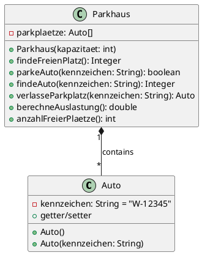

# 3ahwii plf2: Parkhaus-Leitsystem (Arrays)

## UML-Diagramm

**Für alle Klassen und Methoden sind Testfälle hinterlegt.**

Orientieren Sie sich bei der Implementierung daran!

----

## Implementierung Auto

Implementieren Sie in der Klasse `Auto` alle im UML-Diagramm skizzierten Methoden.

### Auto()

Der Default-Konstruktor setzt das Kennzeichen auf "noch nicht angemeldet".

### getKennzeichen()

Liefert das Kennzeichen des Autos zurück.

### setKennzeichen(kennzeichen)

Das kennzeichen darf nicht null oder leer sein.

## Implementierung Parkhaus

Implementieren Sie für die Klasse `Parkhaus`, die Parkplätze mithilfe eines Arrays verwaltet, alle im UML-Diagramm skizzierten Methoden.

### Parkhaus(kapazitaet)

Erstellt ein Array der angegebenen Kapazität. Die Kapazität muss mindestens 1 sein.

### findeFreienPlatz()

Liefert den Index des nächsten freien Parkplatzes zurück, ausgehend von Index 0 (nächster zum Ausgang).

Ist kein freier Parkplatz vorhanden, wird null zurückgeliefert.
Nutzen Sie eine lineare Suche von Index 0 bis zum letzten Index.

### parkeAuto(kennzeichen)

Parkt ein Auto mit dem übergebenen Kennzeichen am nächsten freien Parkplatz.

Liefert `true` zurück, wenn das Auto erfolgreich geparkt wurde.
Ist kein freier Parkplatz vorhanden oder das Kennzeichen ist null/leer, wird `false` zurückgeliefert.

### findeAuto(kennzeichen)

Liefert den Index des Parkplatzes mit dem Auto des übergebenen Kennzeichens zurück.

Wird das Auto nicht gefunden, wird null zurückgeliefert.
Ist das Kennzeichen null, dann antworte mit einer "NullpointerException", ist der string leer oder besteht nur aus whitespace, antworte mit einer "IllegalArgumentException".

### verlasseParkplatz(kennzeichen)

Entfernt das Auto mit dem übergebenen Kennzeichen aus dem Parkhaus.

Liefert das entfernte Auto-Objekt zurück.
Wird das Auto nicht gefunden, wird `null` zurückgeliefert.
Ist das Kennzeichen null, dann antworte mit einer "NullPointerException", ist der string leer oder besteht nur aus whitespace, antworte mit einer "IllegalArgumentException".

### berechneAuslastung()

Liefert die Auslastung des Parkhauses in Prozent zurück (0.0 bis 100.0).

Berechnung: `(Anzahl der belegten Plätze / Gesamtkapazität) * 100`

### anzahlFreierPlaetze()

Liefert die Anzahl der freien Parkplätze (null-Werte im Array) zurück.

----
Anmerkung: Bei Angabe-Projekt gibt es einige Testfälle, welche bereits jetzt erfolgreich durchlaufen:

`Tests run: 49, Failures: 38`

**Gutes Gelingen!**
